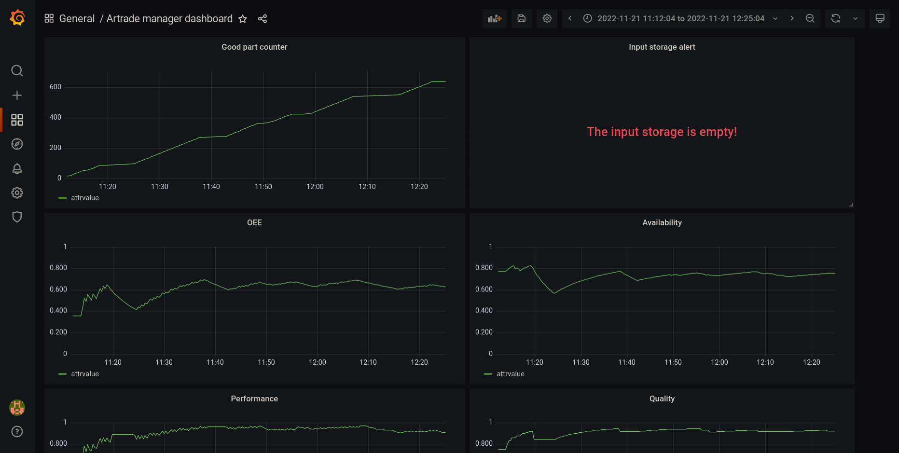
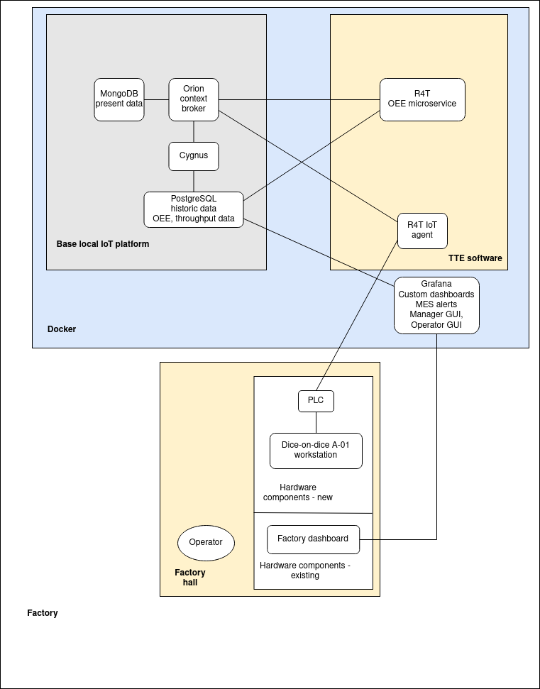

# Manufacturing OEE and MES Alert Management System (MOMAMS)

## Contents

- [MOMAMS](#title)
  - [Contents](#contents)
  - [Purpose](#purpose)
  - [Overview](#overview)
  - [Architecture and modules](#architecture-and-modules)
  - [How to adapt it?](#how-to-adapt-it)
  - [How to deploy it?](#how-to-deploy-it)
  - [How to use it?](#how-to-use-it)
  - [Try MOMAMS](#try-momams)
  - [Environment restrictions](#environment-restrictions)
  - [Known limitations](#known-limitations)
  - [Improvements backlog](#improvements-backlog)
  - [License](#license)
  - [Version history](#version-history)

## Purpose

MOMAMS provides a system for
- logging manufacturing systems,
- calculating OEE values,
- OEE visualisation and
- sending alerts for operators about failures or upcoming tasks.

You can see a manager dashboard below:

## Overview
The system was developed as a part of a [DIH²](http://dih-squared.eu/) project.
Developed by the Robo4Toys (R4T) TTE: [Artrade Ltd.](https://shop.rubik.hu/en/), Grip-Plast Ltd., [Robo-Tech Service Ltd.](https://robo-tech.hu/en/).

The system is capable of handling manufacturing systems that
- match the criteria of the [Job-shop scheduling problem](https://en.wikipedia.org/wiki/Job-shop_scheduling),
- is capable of constantly updating the objects in the Orion context broker.

## Architecture and modules
The overall architecture is shown below: 

The software components can be separated into 3 groups: 
- [Fiware](https://github.com/Fiware/tutorials.Getting-Started) software components,
- 3rd party software,
- Custom TTE software.

The [R4T OEE microservice](https://github.com/aviharos/oee) and the [R4T IoT agent for HTTP compatible devices](https://github.com/aviharos/iotagent-http) are microsercices that can be used integrated into the MOMAMS system or without integration.

The software components run in [docker](https://www.docker.com/) containers in a project as follows.

The [Orion Context Broker](https://fiware-orion.readthedocs.io/en/master/) handles the current data in a [MongoDB](https://www.mongodb.com/) database.

Even though the software solution is designed to handle multiple Workstations, the Robo4Toys TTE needed to supervise one. The robot controller PLC controls the manufacturing cell that is treated as a unit. The PLC uses an Arduino and a Raspberry Pi to send updates to the Orion Context Broker or the [R4T IoT agent for HTTP compatible devices](https://github.com/aviharos/iotagent-http) that acts as an adapter between the Raspberry Pi and the Orion Context Broker.

The Orion objects need to be created using [Postman](https://www.postman.com/) at startup, because the PLC data packets cover only the changes in the objects. This is how the Orion Context Broker knows about the changes in the objects' attributes. The Siemens LHTTP library does not support `'Content-Type: application/json'`, but the IoT agent can be used to translate between `'Content-Type: text/plain'` and `'Content-Type: application/json'` HTTP requests, thus enabling the PLC to send a wide variety of HTTP requests.

The Orion Context Broker notifies [Fiware Cygnus](https://github.com/FIWARE/tutorials.Historic-Context-Flume) whenever a component changes. Cygnus stores all historical data into a [PostgreSQL](https://www.postgresql.org/) historic database. The user needs to configure this notification when the docker project is started.

The [R4T OEE microservice](https://github.com/aviharos/oee) periodically calculates the OEE data and the throughput of each Workstation object and constantly updates them as separate Orion objects. There is one OEE and Throughput object for each Workstation. Since Cygnus logs the changes in the OEE and Throughput objects too, there will be one PostgreSQL table for the OEE and Throughput objects' logs for each Workstation.

[Grafana](https://grafana.com/) is connected to the PostgreSQL. It is configured with custom dashboards. Operators and managers can be configured to have different privileges and different dashboards. Grafana is also configured to check certain values, and if they exceed or fall below a certain threshold, Grafana sends an alert to the operator about a task through [Discord](https://discord.com/). The Grafana configuration, including alerting is covered in-depth in the official tutorials. The alert can also be displayed on the dashboard using Grafana's value mapping feature.

## How to adapt it?

First of all, read the [R4T OEE microservice's docs](https://github.com/aviharos/oee). It covers most of the adoption of MOMAMS. You need to follow the OEE microservice's data model is described in the OEE microservice's README. MOMAMS extends this data model with the following:

- Storages:
    - add storage objects with counters
- Jobs:
    - add the following attributes to each Workstation:
        - RefWorkstation: refers to the Workstation of the Job's current operation

See the [json](json) folder for an example setup.

## How to deploy it?

Prerequisites:
 - Deployment requires [Docker Compose](https://docs.docker.com/compose/install/) v3.5 or above.
 - The OEE app needs to be [built](https://github.com/aviharos/oee#build) with docker
 - The IoT agent must be [built](https://github.com/aviharos/iotagent-http#build) with docker
 - During initial installation, internet access is required in order to download additional docker images according to [docker-compose.yml](docker-compose.yml)

The environment variables (database login credentials, configuration, etc) need to be set in the [.env](.env) file.

Start docker project using docker-compose:

	$ docker-compose -p momams up -d

## How to use it?

Then the Orion Context Broker must be [configured to notify Cygnus](https://github.com/aviharos/oee#notifying-cygnus-of-all-context-changes) of all context changes.

At startup, each object's initial state needs to be uploaded to the Orion context broker except for the OEE and Throughput objects. The representation of the manufacturing system, the jobs and the parts, etc. are defined here. The objects must match match the OEE microservice's [requirements](https://github.com/aviharos/oee#objects-in-the-orion-context-broker).

Whenever an attribute of any object (except the OEE and Throughput objects) changes, you must update it in the Orion Context Broker using a PLC's HTTP function, a Raspberry Pi or other device.

The Grafana dashboards and alerts needs to be set up according to the company's specific needs. Grafana uses PostgreSQL historic data.

## Try MOMAMS

You can try MOMAMS before deploying it on test data. The steps needed for this can be found below. You can use these steps on GNU/Linux systems or Windows WSL2.

### Install docker and docker-compose

### Install MOMAMS, build Robo4Toys microsercices:

    $ git clone https://github.com/aviharos/oee.git 
    $ cd oee
    $ docker build -t oee:latest .
    $ cd ..
    $ git clone https://github.com/aviharos/iotagent-http.git
    $ cd iotagent-http
    $ docker build -t iotagent-http:latest .
    $ cd ..
    $ git clone https://github.com/aviharos/momams.git 

### Install [Postman](https://www.postman.com/)

### Start MOMAMS

    $ cd momams
    $ docker-compose -p momams up -d 

### Notify Cygnus of all context changes

    $ chmod +x ./notify_cygnus.sh
    $ ./notify_cygnus.sh

### Postman commands

Import the [demo Postman request collection](demo/Postman_requests.json).

Use the "Update all objects" request to create or reset the objects any time you want.

Click on all the GET requests to get the Orion objects. You can use these requests to query the Orion objects any time during the demo - including the OEE and Throughput objects. Please, study how the data model works in this case.

You can simulate turning the InjectionMoulding1 machine on and off with their respective requests. You can also simulate good and reject parts made with these two requests.

Turn on the InjectionMoulding1 machine. Make a few good parts and if you want, rejects too. Wait for about a minute, then get the OEE and Throughput objects. You can make parts periodically, and see how that affects the OEE values.

### Grafana

Set up Postgres as a Grafana data source. Keep in mind that since Grafana and Postgres are both on the same docker network, you do not need TLS authentication, the hostname is postgres-db. You can see the Postgres password in the [.env](.env) file.

You can find 3 Grafana dashboards in the [demo/Grafana](demo/Grafana) folder in json format. Create 3 new dashboards in Grafana, then open them one by one, click settings, and copy-paste one of the dashboard's json data to recreate it.

If you like, you can specify a Grafana alert for the TrayLoaderStorage's Counter as described [here](https://grafana.com/docs/grafana/latest/alerting/). You can use any alert channel you like. You can use the alerts dashboard. The normal users do not need to see this, this can remain a hidden dashboard only for alerting purposes.

### Stop MOMAMS

Log out of Grafana, then

    $ docker-compose -p momams down

### Try the IoT agent

You can try the IoT agent as described [here](https://github.com/aviharos/iotagent-http#testing). During the tests you will see how the IoT agent can transform the HTTP requests and what the response is to each request.

## Environment Restrictions

## Known Limitations
The manufacturing processes must be able to translated into a Job-shop scheduling problem.

## Improvements Backlog

## License

[MIT license](LICENSE)

The Robo4Toys TTE does not hold any copyright of any FIWARE or 3rd party software.

## Version History

